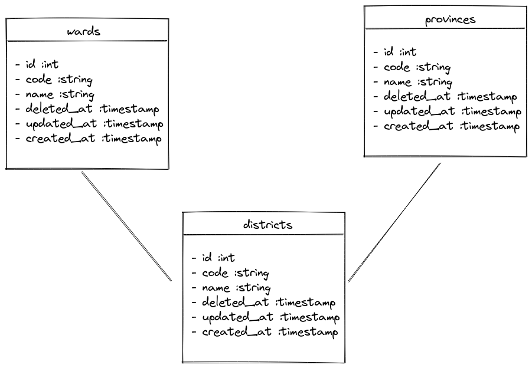

# A Laravel package for interacting with Vietnamese administrative units

[](https://packagist.org/packages/dileedotdev/laravel-vietnamese-administrative-units)
[](https://github.com/dileedotdev/laravel-vietnamese-administrative-units/actions?query=workflow%3Arun-tests+branch%3Amain)
[](https://github.com/dileedotdev/laravel-vietnamese-administrative-units/actions?query=workflow%3A"Fix+PHP+code+style+issues"+branch%3Amain)
[](https://packagist.org/packages/dileedotdev/laravel-vietnamese-administrative-units)

This is where your description should go. Limit it to a paragraph or two. Consider adding a small example.

## Installation

You can install the package via composer:

```bash
composer require dileedotdev/laravel-vietnamese-administrative-units
```

You should publish and run the migrations with:

```bash
php artisan vendor:publish --tag="laravel-vietnamese-administrative-units-migrations"
php artisan migrate
```

You can publish the config file with:

```bash
php artisan vendor:publish --tag="vietnamese-administrative-units-config"
```

This is the contents of the published config file:

```php
return [
    'province' => [
        'model' => \VietnameseAdministrativeUnits\Models\Province::class,
        'table' => 'provinces',
    ],

    'district' => [
        'model' => \VietnameseAdministrativeUnits\Models\District::class,
        'table' => 'districts',
    ],

    'ward' => [
        'model' => \VietnameseAdministrativeUnits\Models\Ward::class,
        'table' => 'wards',
    ],
];
```

## Usage



As you can see, the package provides 3 models: `Province`, `District`, and `Ward`. Each model uses soft delete. (because in Vietnam, administrative units probably change in the future)

### Import data

The first thing you need to do is import administrative units to the database. You can use the command:

```bash
php artisan vietnamese-administrative-units:import
```

By default, this command will use a CSV file placed in `./assets/vietnamese-administrative-units.csv`. You can change the file using by passing a path to the file as an argument:

```bash
php artisan vietnamese-administrative-units:import /home/dilee/Downloads/vietnamese-administrative-units.csv
```

If you wonder where the CSV file comes from, you can find it [here](https://www.gso.gov.vn/phuong-phap-luan-thong-ke/danh-muc/don-vi-hanh-chinh/) check on "Quận Huyện, Phường Xã" and click "Xuất Excel" to download the Excel file, next you should manually convert the Excel file to CSV file without changing any data.

### Using models

You can use the models as usual:

```php
use VietnameseAdministrativeUnits\Models\Ward;

class YourModel {
    public function ward()
    {
        return $this->belongsTo(
            config('vietnamese-administrative-units.ward.model', Ward::class)
        )->withTrashed();
    }
}
```

As I said before, each model uses soft delete, so you should use `withTrashed()` to get a relationship regardless the model is deleted or not.

And don't forget to define a foreign key in your migration:

```php
return new class extends Migration
{
    public function up()
    {
        Schema::table('your_table', function (Blueprint $table) {
            $table->foreignId('ward_id')->constrained();
        });
    }
}
```

Below is some useful code:

```php
use VietnameseAdministrativeUnits\Models\Province;
use VietnameseAdministrativeUnits\Models\District;
use VietnameseAdministrativeUnits\Models\Ward;

// Get all provinces
Province::all();

// Get all districts
District::all();

// Get all wards
Ward::all();
```

### Can I use the import command many times?

Yes, you can. The command is smart enough to check if the administrative unit is already in the database, it will skip that unit and soft delete any unit that is not in the CSV file.

### What I should do if the CSV file I provided is outdated?

I will periodically update the CSV file, so rarely you need to update the CSV file yourself. But if the CSV file is outdated, you can follow the below solutions:

Firstly, the command optionally receives the custom path to the CSV file, so you can download the new CSV file and pass it to the command.

Secondly, you can go to the Github repository of this package, create a pull request to update the CSV file, and I will merge it as soon as possible.

Finally, if the above solutions are too complicated for you, easily you can create an issue on Github to ping me to update the CSV file.

## Testing

```bash
composer test
```

## Changelog

Please see [CHANGELOG](CHANGELOG.md) for more information on what has changed recently.

## Contributing

Please see [CONTRIBUTING](CONTRIBUTING.md) for details.

## Security Vulnerabilities

Please review [our security policy](../../security/policy) on how to report security vulnerabilities.

## Credits

-   [Dileedotdev](https://github.com/dileedotdev)
-   [All Contributors](../../contributors)

## License

The MIT License (MIT). Please see [License File](LICENSE.md) for more information.
